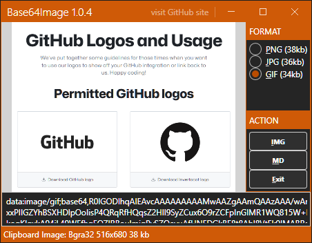
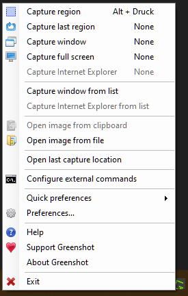
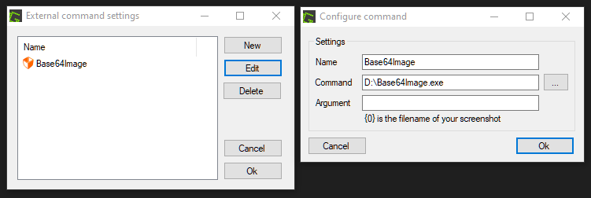
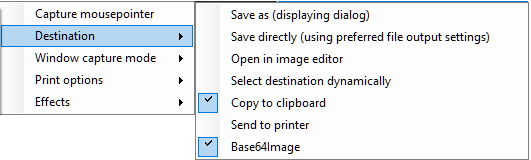

# Base64Image

Base64Image is a [Greenshot](https://github.com/greenshot/greenshot) Plugin to easily create embedded base64 images for your html or md files.  
Even though the primary scope is on *Greenshot* the Base64Image executable can work/run independent

## How to use Base64Image

Once [Base64Image.exe](https://github.com/pagebox/Base64Image/releases) is executed it expects an image in the users clipboard.  
This image can come from *Snipping Tool*, *Greenshot* or any other tool, which can put an image/a screenshot into the clipboard.
If the image could be loaded, the main window shows up like this:

> Note, it selects automatically the image format of the lowest size. 
> On the bottom, just below the preview, you already have the original image encoded in Base64.

You have the following choices: 
- press the key <kbd>I</kbd> => It will replace the clipboard with the Base64 encoded image based on the selected format.
- press the key <kbd>M</kbd> => It does the same as hitting <kbd>I</kbd>, but embeds the Base64 data into an html img tag. Usefull if you want to add it directly to markdown or html.
- press the <kbd>Esc</kbd> Key and the original image remains untouched in the clipboard.

## How to setup Greenshot

- Start Greenshot and click on its taskbar icon.  

- Select *Configrue external commands*. 
- On the *External command settings* window click on *New*

- Give the new entry a name, eg. Base64Image
- Browse to the executable and choose it. 
- No Arguments are needed.
- OK - OK
- Click on Greenshots taskbar icon again 
- Select *Quick preferences* => *Destination*

- Make sure *Copy to clipboard* and *Base64Image* is selected

Now, after you take a screenshot with Greenshot the image will be put to the clipboard and Base64Image will be executed.
